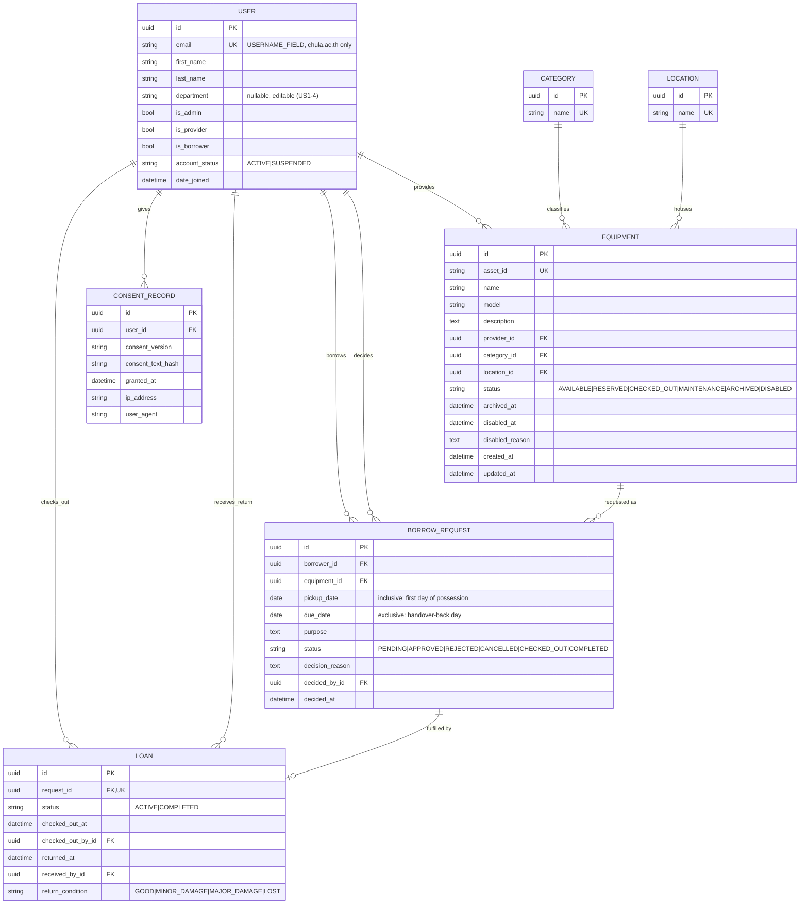

# UniWare ER Diagram

```mermaid
erDiagram
	USER ||--o{ EQUIPMENT : provides
	USER ||--o{ BORROW_REQUEST : borrows
	USER ||--o{ BORROW_REQUEST : decides
	USER ||--o{ LOAN : checks_out
	USER ||--o{ LOAN : receives_return
	USER ||--o{ CONSENT_RECORD : gives
	CATEGORY ||--o{ EQUIPMENT : classifies
	LOCATION ||--o{ EQUIPMENT : houses
	EQUIPMENT ||--o{ BORROW_REQUEST : "requested as"
	BORROW_REQUEST ||--o| LOAN : "fulfilled by"

	USER {
		uuid id PK
		string email UK "USERNAME_FIELD, chula.ac.th only"
		string first_name
		string last_name
		string department "nullable, editable (US1-4)"
		bool is_admin
		bool is_provider
		bool is_borrower
		string account_status "ACTIVE|SUSPENDED"
		datetime date_joined
	}
	CONSENT_RECORD {
		uuid id PK
		uuid user_id FK
		string consent_version
		string consent_text_hash
		datetime granted_at
		string ip_address
		string user_agent
	}
	CATEGORY {
		uuid id PK
		string name UK
	}
	LOCATION {
		uuid id PK
		string name UK
	}
	EQUIPMENT {
		uuid id PK
		string asset_id UK
		string name
		string model
		text description
		uuid provider_id FK
		uuid category_id FK
		uuid location_id FK
		string status "AVAILABLE|RESERVED|CHECKED_OUT|MAINTENANCE|ARCHIVED|DISABLED"
		datetime archived_at
		datetime disabled_at
		text disabled_reason
		datetime created_at
		datetime updated_at
	}
	BORROW_REQUEST {
		uuid id PK
		uuid borrower_id FK
		uuid equipment_id FK
		date pickup_date "inclusive: first day of possession"
		date due_date "exclusive: handover-back day"
		text purpose
		string status "PENDING|APPROVED|REJECTED|CANCELLED|CHECKED_OUT|COMPLETED"
		text decision_reason
		uuid decided_by_id FK
		datetime decided_at
	}
	LOAN {
		uuid id PK
		uuid request_id FK, UK
		string status "ACTIVE|COMPLETED"
		datetime checked_out_at
		uuid checked_out_by_id FK
		datetime returned_at
		uuid received_by_id FK
		string return_condition "GOOD|MINOR_DAMAGE|MAJOR_DAMAGE|LOST"
	}
```
