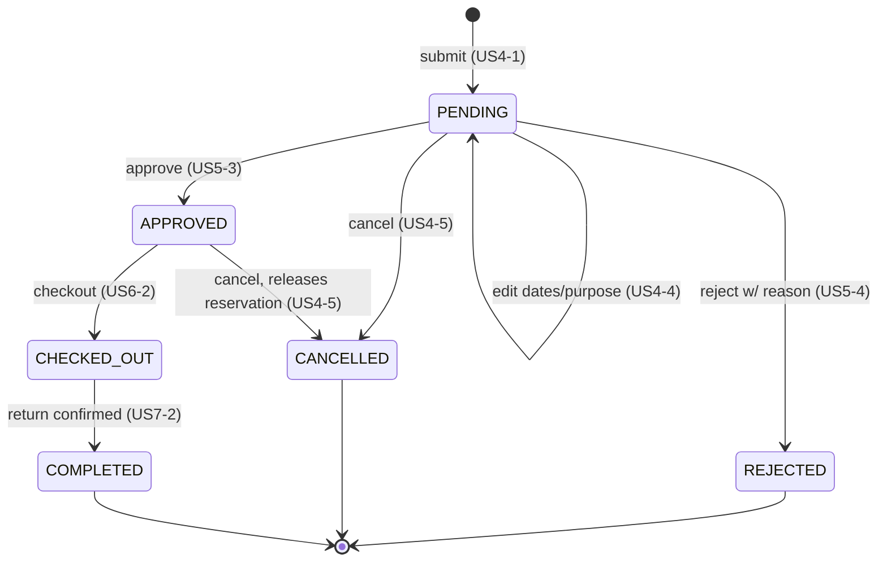
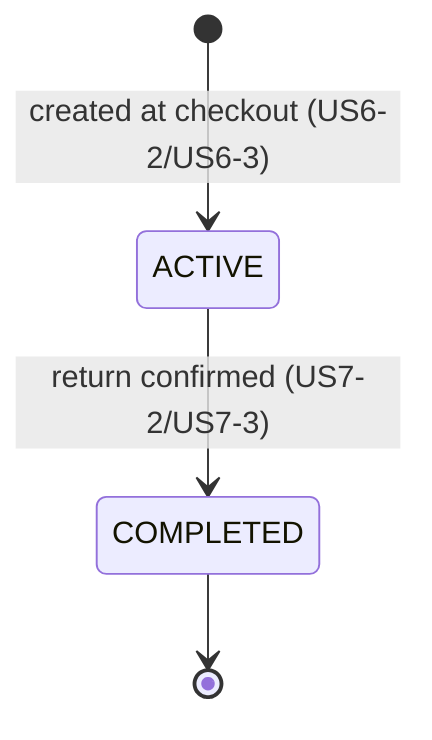

# UniWare — State Machines

## BorrowRequest

```mermaid
stateDiagram-v2
    [*] --> PENDING: submit (US4-1)
    PENDING --> PENDING: edit dates/purpose (US4-4)
    PENDING --> APPROVED: approve (US5-3)
    PENDING --> REJECTED: reject w/ reason (US5-4)
    PENDING --> CANCELLED: cancel (US4-5)
    APPROVED --> CANCELLED: cancel, releases reservation (US4-5)
    APPROVED --> CHECKED_OUT: checkout (US6-2)
    CHECKED_OUT --> COMPLETED: return confirmed (US7-2)
    REJECTED --> [*]
    CANCELLED --> [*]
    COMPLETED --> [*]
```

## Loan

```mermaid
stateDiagram-v2
    [*] --> ACTIVE: created at checkout (US6-2/US6-3)
    ACTIVE --> COMPLETED: return confirmed (US7-2/US7-3)
    COMPLETED --> [*]
```